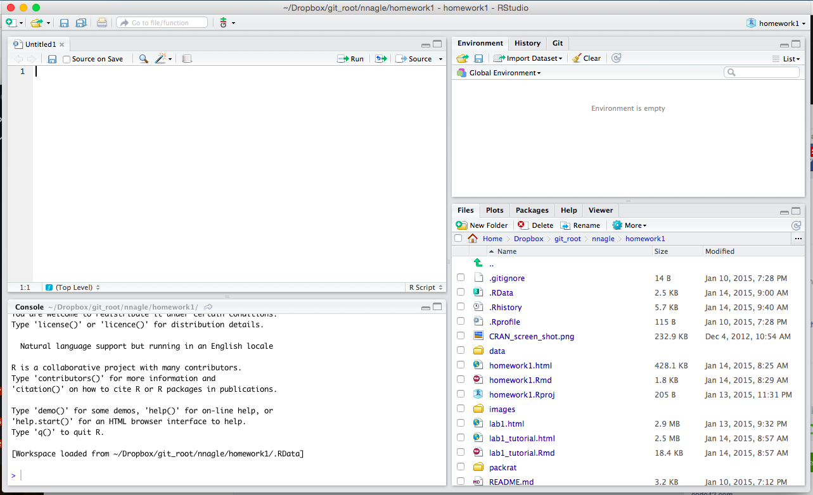

Geography 415 Lab 1 tutorial
========================================================


Objectives
--------------------------------------------------------
 - R tasks
   - Open R and R studio. 
   - Learn basic commands in R: such as creating variables and obtaining specific parts of your data.
   - An introduction to basic plotting and ggplot

Getting Started
---------------------------------------------------------

[Note: You often will find questions or comments in brackets like this.  This indicates that there is something I want to you think about and answer now.  Please discuss it with a lab partner.  You do not need to turn it in.  The homework to be turned in as in the file `homework1.Rmd`]

A first look at R Studio
---------------------------------------
When you open up R studio for the first time, it might look something like this:



 - In the top left, I have a blank, unnamed "R script."  An R script is a text file with the .R extension.  If you don't see one, click `File -> New File -> R Script`.  
 - Below that is the *console*, where you can type in commands.   I treat Console like a scratch pad.  I try commands out there, and when they work, I transfer them to an R script or a markdown file (more on markdown later).  
 - Files is like a windows explorer.  You should be familiar with this concept.  You will have different files than I do, obviously.
 - Environment is a list of all the data inside R.  It should be empty when you first start.  Everytime you create or load something, you should see it here.

For starters, you can use R like a calculator.  Below is a code fragment.  Anything you see in grey, you can either 1) copy and paste to your R Console and then hit Enter to run it, or 2) type from scratch into the R Console.

```{r}
3 + 5
3 * 5
```

Note how the answer is printed out in a new line.  You can also create symbols, just like in algebra.  For example, suppose we want to create a variable called x, and give it the value 3.

```{r}
 x <- 3 # read as 'x gets 3'.  This is the left angle bracket '<' followed by the hyphen '-'
```
You should now see the variable `x` in your workspace window.  You can then use x in math, or change the value x gets.
```{r}
x+2
x <- 4
x+2
```
Note, that if we have an assignment ("<-"), then the result is NOT printed to screen.  It just happens silently.

Note, that the arrow can go either way;  these are identical
```{r}
x <- 4
4 -> x
```
Most people reading your work will find the second way strange, so avoid using it in your code.  (I sometimes find myself doing it at the console when I've used the uparrow to find old commands)

You can also use "=" instead of "<-", but you'll look like an amateur to a long-time R programmer. :)

My workflow
---------------------------------------------------
I treat the Console like a scratchpad, and the Script like someplace where I want to save commands more permanently once I know that they work.  
Scripts are the most important feature of R.  Everything should be in a script (or an R markdown file).  You should be able to run a script by clicking the 'run' button and have your analysis complete run from beginning to end.  This way, if you share your work, you can guarantee that someone else will be able to duplicate your work.  (Most often, that someone is youself, weeks, months or years later.)


So I might try a few commands in the console until I am happy with the result, and then I will copy that command to the script.  I'll run the script periodically just to make sure that everything is still working.

You can also type things in the script, and then automatically copy and past that line to the console with (CMD + Enter) on the Mac (probably Ctrl + Enter on Windows?).  This is convenient too.  The two windows on the right are just for convenience.


Data Types
---------------------------------------------------
There are two main types of data in R: numeric values and character values.  (There's many more, but two's enough for now!)  Let's 1) create  one of each type of data, and 2) then try to add a number and a character, which should lead to an error.

```{r eval=FALSE}
a <- 3
b <- 'three'
a+b
```
That gave a funny error.  Errors in R can be very cryptic.  But the gist of this error is that there is an "operator" in this case "+"; it was expecting numeric values, but got something else instead.  I don't expect you to know what the error means -- half of the time, I have to puzzle over it myself.  But you can solve a lot of problems by pasting pieces of error messages into google.

Getting your hands dirty with data
--------------------------------------------------------

### Getting the data into R.
I've put some data in the repository that were collected in the 18th century by London physician John Arbuthnot to study the sex ratio (the ratio of males to females).  I've put the data in the homework1/data/ folder as a file called arbuthnot.csv.  .csv is the extension for comma separated file.  You can open the file in wordpad or textedit to see what it looks like.  It is just a text file, with every data value separated by a comma.  Comma Separated Files are one of the most transparent ways to save and share data.  You can always export simple spreadsheets from Excel as comma separated file.

```{r}
# Based on where the repository is on my own computer, I enter
arbuthnot <- read.csv(file='/Users/nnagle/Dropbox/git_root/nnagle/homework1/data/arbuthnot.csv')
```
You should see that the Environment window now has a data object called arbuthnot, which has 82 observations and 8 variables.  Click on "arbuthnot" in the workspace window.  You should see a new window that looks like  simplified Excel spreadsheet.  In the crazy language of R, this type of data object is called a 'data.frame.'  


### Getting help in R
#### Getting help in R
The `help()` function is the easiest way to get help in R on a function.  The only function you've seen so far is `read.csv()`, so let's look at the help page for that.
```{r}
help(read.csv)
```

You'll see that the help page has some standard sections.  There is a quick description of the function.  (In this case, you'll see that the help for `read.csv` is merged with the help for a few other functions as well.)  Following the Description is the Usage section, which lists all of the ways to use the function and all of the arguments that it can accept.  You'll see that read.csv can accept many, many more arguments than we used.  Most arguments are optional.  Then you'll see a description of each argument, followed by some more Details about the function that are helpful to know.  Finally, at the very bottom of the help file are some Examples of the function in action.  You can learn a heck of a lot by looking at the examples.

I will admit that the help is often difficult to understand.  The help files are meant to be thorough and complete.  Also, since there are thousands of user contributed packages, not all of the help files are equally good.  Some of them are downright terrible.  We're taught how to do data analysis, not how to write a manual!  I will usually look at the help file first, and then follow that up by looking for help outside of R.

#### Getting help outside of R.
There are lots of resources in the internet for getting help with R.  I've put a page on the class webpage with links to many of these resources.

The single most helpful place to get help, however, is by searching in www.stackoverflow.com.  stackoverflow is a webpage for users of all computer languages.  You can ask questions, and people can answer them, and questions and answers get voted up or down by their usefulness.  But you almost never have to ask a question because someone else has already asked it.  In stackoverflow, you can search for all the questions aabout the R function read.csv by searching for:
"[r] read.csv."  When I did this, there were only 4815 results.  Surely your question is in there somewhere.  When I get a funny error in R, I often just paste a portion of the error message in stackoverflow, and that nearly always brings something up.

You can also search google, but it's a little hit or miss.  It's hard in google to search the letter R.  It's a shame that R didn't pick a more googlable name, but in R's defense, R was around a long before google was.


## Back to the data analysis

Whenever I get data into R, I usually want to see what they look like, especially if they are data that someone sent me (i.e. I didn't collect the data myself).  This is my standard set of tools for getting to know a dataset.
```{r}
# Note, anything after a pound symbol # is a comment and is ignored by R
dim(arbuthnot) # dimension of the data
names(arbuthnot) # the column names
head(arbuthnot) # the head (top) of the data
str(arbuthnot) # the structure of the data
summary(arbuthnot) # a summary of a data.frame
```


Each row of this data.frame contains the observations for one year.  For each year, we have the number of boys christened in London, the number of girls christened, and a few other things, such as the number of deaths from plague.  John Arbuthnot used these data to evaluate the hypothesis that boys and girls are born in equal proportions.  Arubuthnot found that there are more males than females, and attributes this to be a result of the greater mortality faced by young males. The greater number of Male births leads to a relatively even number of males and females by adulthood, and everything works out in the end. In a nutshell, Arbuthnot assumes that the ratio ought to be 50:50, and concludes that the only way there could be more male births than female births would be if there were a Divine Providence to make all the numbers work out so nicely in the end.

[Questions: Why do you think that Arbuthnot collected data on christenings, rather than births?  Remember, this is 18th century London.  How would these data have been collected in 1710?  Do you think christening and births might be similar in 1710?  What about today?]


### Subsetting

One of the most important skills in data analysis is to learn how to select just some data from a dataset.  Suppose that you don't want the entire data set but just one column: maybe the year.  R provides multiple ways to do this.  Sometimes one way is more convenient than other ways.

One way to ask R for a column is to use `[row,column]` notation.  We can ask for every row, but only the column with the name 'Year'
```{r}
x <- arbuthnot[, 'Year'] #Note, row in [row, column] is blank.  This implies all rows.
x
```
We can ask for every row, but only the second column (which, just happens to be the "Year")
```{r}
y <- arbuthnot[,2]
y
```

Note, that in the first case, Year was in quotes, but in the second case, the 2 was not.  

In general... I always recommend using Proper Names rather than numbers.  Sometimes data get rearranged.  For example, maybe you added or deleted a column along the way or rearranged their order.  If you use the name, you'll always get what you mean.  If you use the number, then you are assuming that what you want is in a particular place.  Sometimes assumptions are correct.  Sometimes they aren't.

There is still one other common way to get a single column of a data.frame:
```{r}
z <- arbuthnot$Year
z
```

Here's another bit of notation: What if I only want the first five rows:
```{r}
arbuthnot[1:5,'Year']
```

R also provides a pretty smart command called subset to select specific rows.  This will return all rows of the data in which Male births is 10% more than the Female Births:
```{r}
subset(arbuthnot, Males > 1.1*Females)
```
Note, 10% more of $x$ is $1.1 x$.  10% less would be $0.9 x$.  100% more is $2x$.  You should be comfortables going back and forth between percentages and decimals.


And finally, suppose I want two columns: Males and Females.  Here are two ways to do that:
```{r}
arbuthnot[, c('Males', 'Females')] # Note that I put the names inside a c()
# c() is the combine function.  It's used a lot in R.
# Another way to get these columns
arbuthnot[, 3:4] # This is much less safe.  What if the data were rearranged?  Then I might not get what I wanted.
```


It's important that you become familiar with how to ask R for certain rows and columns.  It's also important that you develop the habit of referring to things by name rather than by number.  You'd be surprised how many idiotic mistakes scientists make by not referring to something by name.


An Introduction to Visualization
------------------------------------------------
Now that we know how to ask R for only some of the data, we can think about the best ways to visually explore the data or to communicate the patterns and stories that are hidden in the data.

There are two primay graphing packages in R:
 - base
 - ggplot
 
base is quick and dirty.  Out of the box, base produces ugly plots, but it can be simple to use.  With ggplot it is much easier to create beautiful plots that people will actually want to look at and try to understand.  The New York Times, which cares quite a bit about whether people want to look at it or not (and even to pay money to look at it), uses ggplot.  So that should indicate something.

I'll show how to plot Male births and Female births using both the base package and the ggplot package.

## base
One natural way to plot the data would be to let the x-axis represent time (years), and the y-axis represent the number of christenings.


```{r}
plot(x=arbuthnot$Year, y=arbuthnot$Males)
```
You see that the default is points.

```{r}
plot(arbuthnot$Year, arbuthnot$Males, type='l') 
# 'l' for lines.  see the help for other choices
# Note the x= and y= is optional.  Just make sure you don't swith the order!!!!
```

To add another plot, use the lines command
```{r}
plot(arbuthnot$Year, arbuthnot$Males, type='l') 
lines(x=arbuthnot$Year, y=arbuthnot$Females)
```
Not very helpful.  We need color or dashes, or something:

```{r}
plot(arbuthnot$Year, arbuthnot$Males, type='l') 
lines(x=arbuthnot$Year, y=arbuthnot$Females, col='red')
```
The help file for plot will show you some of the options that you can use.

That's about all I will show you of base plotting, because that's about all I use if for:  quick plotting.  I don't find that it meets the standards for reports or any other form of publication.


## ggplot
We're going to use the ggplot2 package which is not loaded by default.  The following line loads in the package:
```{r}
library(ggplot2)
```
This section will have a lot of plotting commands with increasing complexity.  You can largely copy and paste them.  To see what functions are available in a package, you can type `help(package='ggplot2')`, but don't worry about this for now.

The quick and dirty way of plotting with ggplot is the `qplot` fuction.  It's a lot like plot:
```{r}
qplot(arbuthnot$Year, arbuthnot$Males, geom='line') 
```

But qplot isn't where it's at in ggplot...

### The "grammar" of graphics: the 'gg' in ggplot
Just as sentences are constructed from subjects, verbs and objects, a graphic has it's own grammar.  A graphic has:

 - data
 - a linking (also called a mapping) from the data to an **aesthetic** (for example, will one variable be "x", another variable "y", another variable "color", etc?)  An aesthetic is something to see with our eyes, and we need to link the data to what we can see.
 - geometric objects: such as points, lines, polygons,
 - scales: each aesthetic will need a scale.  how do you you know if something is higher or lower?  What do the colors mean? etc.
 - (less common) a coordinate system: cartesion coordinates, polar coordinates, etc.  
 
 So, to make our plot, the data are `arbuthnot`.  The aesthetics are `x=Year` and `Y=Males` or `Y=Females`, and the geometric type is a line.  We'll use the default scales.  This is what that looks like:

```{r}
ggplot(data=arbuthnot) + geom_line(aes(x=Year, y=Males))
```

We can change the y-axis title.  The y-axis is a scale, and we want to rename it:
```{r}
ggplot(data=arbuthnot) + geom_line(aes(x=Year, y=Males)) + 
  scale_y_continuous(name='Male Christenings')
```
Remember, you can use `help()` to find out more about any of these functions.  If you look at the help for `scale_y_continuous` it will actually refer you to the help for `continuous_scale` in order to see all of the available options.


There's a shortcut for axis labels:
```{r}
ggplot(data=arbuthnot) + geom_line(aes(x=Year, y=Males)) + ylab('Male Christenings')
```


Suppose you wanted to plot both Males and Females (Arbuthnot was, after all, interested in the sex ratio).  Now, we need two line geometric objects

```{r}
ggplot(data=arbuthnot) + 
  geom_line(aes(x=Year, y=Males, color='Male')) + 
  geom_line(aes(x=Year, y=Females, color='Females')) + ylab('Christenings')
```

ggplot noticed that we have two different lines and created a third aesthetic - color -  to keep them straight, but it didn't know what to call this third aesthetic.  Now we have three aesthetic mappings: x, y, and color.  x and y have a continuous scale, and color has a discrete scale.  Let's fix the title of the color scale: we can do either `+ scale_color_discrete(name='Sex')` or use a shortcut `+ labs('Sex')`.

```{r}
ggplot(data=arbuthnot) + 
  geom_line(aes(x=Year, y=Males, color='Male')) + 
  geom_line(aes(x=Year, y=Females, color='Females')) + 
  ylab('Christenings') + labs('Sex')
```

Let's make it a little more legible with thicker lines. 

```{r}
ggplot(data=arbuthnot) + 
  geom_line(aes(x=Year, y=Males, color='Male'), size=2) + 
  geom_line(aes(x=Year, y=Females, color='Females'), size=2) + 
  ylab('Christenings') + labs('Sex')
```
Note, that line size is outside of the aesthetic.  We're not going to use size to distinguish between the lines.  We could have, though.

### Plotting the sex ratio:
Arbuthnot's question was: Is the sex ratio of males and females even.  We might want to plot the ratio of males-to-females:
```{r}
ggplot(data=arbuthnot) + 
  geom_line(aes(x=Year, y=Males/Females))+ 
  ylab('Male:Female Sex Ratio')
```

That looks like a lot of moving around, but notice that it's within a really small range.  We can fix that by changing the scale of the y-axis

```{r}
ggplot(data=arbuthnot) + 
  geom_line(aes(x=Year, y=Males/Females))+
  scale_y_continuous(limits=c(0, 1.5)) +
  ylab('Male:Female Sex Ratio')
```
Now it looks pretty flat.

Another bit of helpfulness would be to point out where the 1:1 ratio is, because that's pretty important.  We can add a line with intercept 1 and slope 0.  The `abline` geometry is the one to use:

```{r}
ggplot(data=arbuthnot) + 
  geom_line(aes(x=Year, y=Males/Females))+
  scale_y_continuous(limits=c(0, 1.5)) +
  geom_abline(intercept=1, slope=0)
  ylab('Male:Female Sex Ratio')
```


[Questions:  Are more males christened than females?  Are you certain?  How certain?  Why are you this certain?  Are more males born than females?  How certain are you?  Why?]


There.  We're done with the tutorial.


